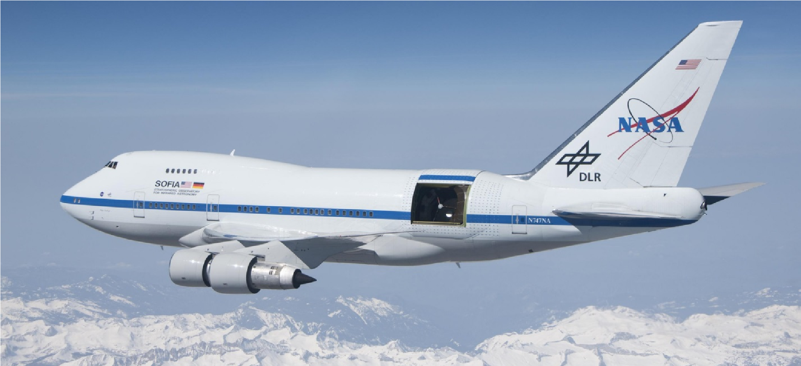

Print your own 3D SOFIA model 
 
Now you can print your own 3D model of SOFIA, the Stratospheric Observatory for Infrared Astronomy. SOFIA is a modified Boeing 747SP aircraft that carries a 106-inch telescope, making it the largest airborne observatory in the world.  
 
Introduction 
 
SOFIA flies higher than commercial jetliners to get above 99% of the water vapor in Earth’s atmosphere, which blocks infrared light from reaching the ground. This is why SOFIA is capable of making observations that are impossible for even the largest and highest ground-based telescopes. 
 
Scientists use SOFIA to study how stars and solar systems form, the atmospheres of other planets (like Jupiter) and moons (like Neptune’s moon Triton), comets, black holes, supernovae, and to identify complex molecules in space. SOFIA also promotes the development of new scientific instruments and fosters the education of young scientists and engineers. SOFIA makes 3-4 overnight flights each week, with each flight lasting 8-10 hours. 
 
SOFIA is a joint project of NASA (80%) and the German Aerospace Center, DLR (20%). NASA’s Ames Research Center in California’s Silicon Valley manages the SOFIA program, science and mission operations in cooperation with the Universities Space Research Association headquartered in Columbia, Maryland, and the German SOFIA Institute (DSI) at the University of Stuttgart. The aircraft is maintained and operated from NASA’s Armstrong Flight Research Center Hangar 703, in Palmdale, California. 
 
You can find more information about SOFIA at https://www.nasa.gov/sofia and at https://www.sofia.usra.edu/. 
 
For more details about the parts of the SOFIA aircraft and telescope, see the self-guided tour of SOFIA at https://www.sofia.usra.edu/sites/default/files/self-guided_tour.pdf, as well as the information below. For a virtual reality tour of SOFIA, check out the “NASA and DLR’s Flying Telescope SOFIA” Google Expedition at https://edu.google.com/expeditions/. 

