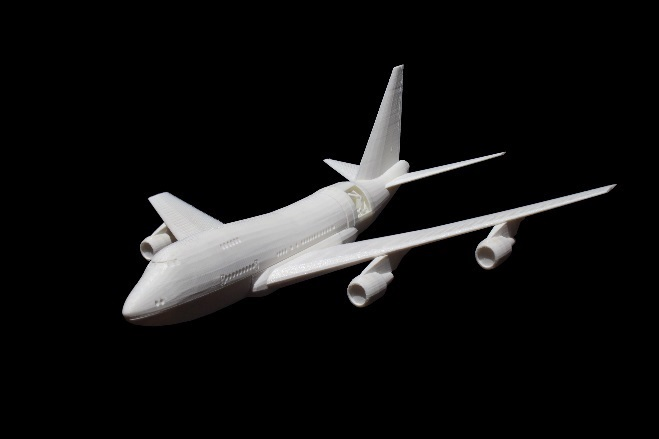
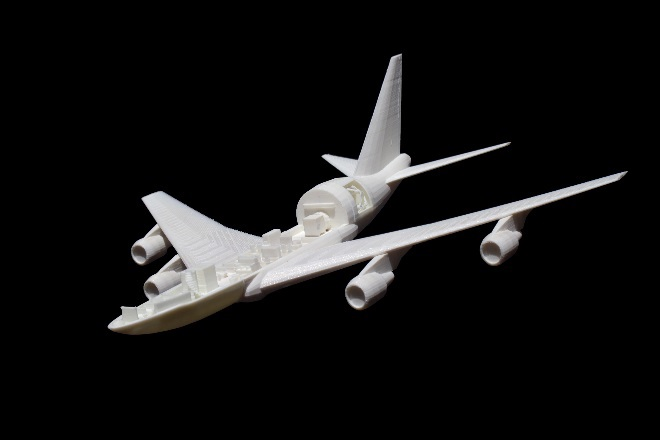
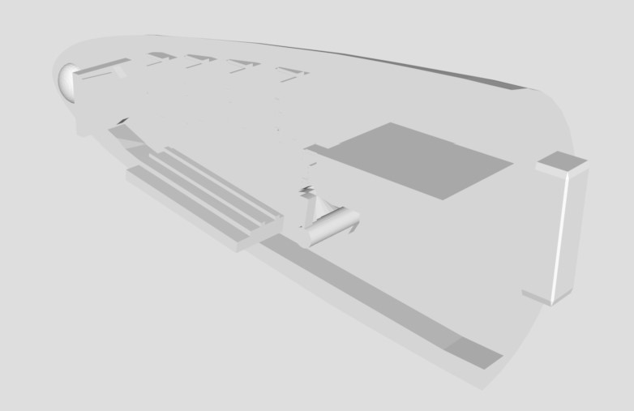
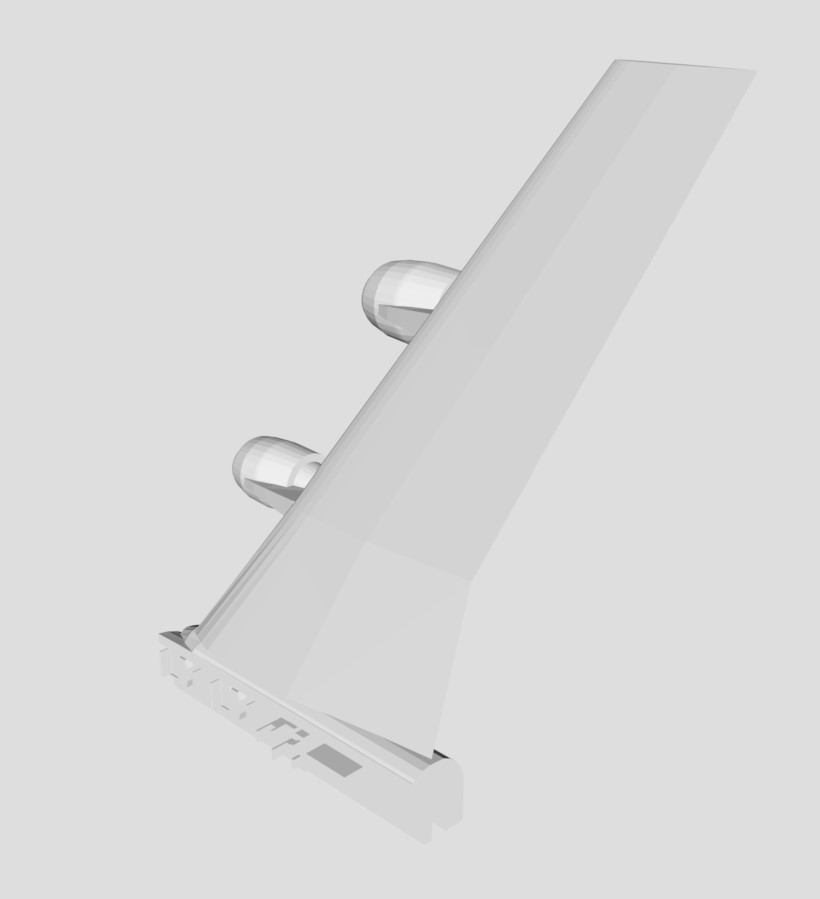

# Print your own 3D SOFIA model 
 
Now you can print your own 3D model of SOFIA, the Stratospheric Observatory for Infrared Astronomy. SOFIA is a modified Boeing 747SP aircraft that carries a 106-inch telescope, making it the largest airborne observatory in the world.  
 
# Introduction 
 
SOFIA flies higher than commercial jetliners to get above 99% of the water vapor in Earth’s atmosphere, which blocks infrared light from reaching the ground. This is why SOFIA is capable of making observations that are impossible for even the largest and highest ground-based telescopes. 
 
Scientists use SOFIA to study how stars and solar systems form, the atmospheres of other planets (like Jupiter) and moons (like Neptune’s moon Triton), comets, black holes, supernovae, and to identify complex molecules in space. SOFIA also promotes the development of new scientific instruments and fosters the education of young scientists and engineers. SOFIA makes 3-4 overnight flights each week, with each flight lasting 8-10 hours. 
 
SOFIA is a joint project of NASA (80%) and the German Aerospace Center, DLR (20%). NASA’s Ames Research Center in California’s Silicon Valley manages the SOFIA program, science and mission operations in cooperation with the Universities Space Research Association headquartered in Columbia, Maryland, and the German SOFIA Institute (DSI) at the University of Stuttgart. The aircraft is maintained and operated from NASA’s Armstrong Flight Research Center Hangar 703, in Palmdale, California. 
 
You can find more information about SOFIA at https://www.nasa.gov/sofia and at https://www.sofia.usra.edu/. 
 
For more details about the parts of the SOFIA aircraft and telescope, see the self-guided tour of SOFIA at https://www.sofia.usra.edu/sites/default/files/self-guided_tour.pdf, as well as the information below. For a virtual reality tour of SOFIA, check out the “NASA and DLR’s Flying Telescope SOFIA” Google Expedition at https://edu.google.com/expeditions/. 

# The model 
 
With the help of the NASA Ames SpaceShop Rapid Prototyping Facility, the SOFIA mission has created an eight-piece, 3D-printable model of the SOFIA 747SP aircraft. The printable files are at a 1/200 scale, with interior details and a removable upper fuselage section. This model features interchangeable open- and closed-telescope cavity configurations and telescope instruments. 
The model was has been simplified for durability and printing where needed. 

Table of Contents 
* [Preview] 
* [Model files]
  * [Nose_section.stl]
  * [Right_wing.stl]
  * [Left_wing.stl]
  * [Tail_section.stl]
  * [Instrument.stl]
  * [Telescope_cavity_open.stl]
  * [Telescope_cavity_closed.stl]
  * [Fuselage_top.stl]
*	[Printing tips]
*	[Credits]
 
If you print and use this model, we would love to hear about your experiences. Please consider 
sharing a photograph by opening a pull request, sharing it with SOFIA on social media @SOFIAtelescope, or contacting us at arc-sofia-contact@mail.nasa.gov. 

  
  

## Model files 

### Nose Section (Including Forward Aircraft Interior) 
  

The forward part of SOFIA’s main deck still resembles the first-class section from the aircraft’s commercial days. These seats are used during takeoff and landing when the seats around the consoles and conference tables in the rear part of the cabin are full. This section also contains the lavatories, the galley and the staircase leading to the upper deck. 

Along one wall of the interior of the nose section are the mission controls and communications system (MCCS) racks. These are the computer systems that run the mission control stations and the headset system that the team uses to communicate. Headsets enable the team downstairs to easily communicate with each other and the flight crew upstairs. 

The cockpit is on the upper deck of the aircraft and is not shown in this model. SOFIA’s cockpit crew includes a pilot, copilot, flight engineer and navigator. The flight crew works closely with the mission director downstairs to ensure the observatory is in the right place at the right time to conduct its observations. The upper deck also features more seating and the engineering station computer racks. 

## Right Wing (Including Aircraft Interior) 

SOFIA is powered by four Pratt & Whitney JT9D-7J turbofan engines, rated at 50,000 pounds of thrust each. Two are on the right wing, and two are on the left. 

Interior details (front to back): 

*	Science Conference Table – Scientists from all over the world apply for time to use the telescope. When they fly to conduct their observations, they sit at these conference tables. 
*	Telescope Team Seats - German SOFIA Institute (DSI) engineers occupy these seats to test and monitor the telescope’s performance. 
*	Telescope Operators Station – These computers allow the telescope operators to control the telescope. They can move the telescope up and down, approximately 20-60 degrees above the horizon, to keep it pointed at the object the scientists are observing. The telescope cannot point down. 
*	Observatory Electronics Rack – These computers include the telescope cavity environmental control systems, as well as other control systems. 

